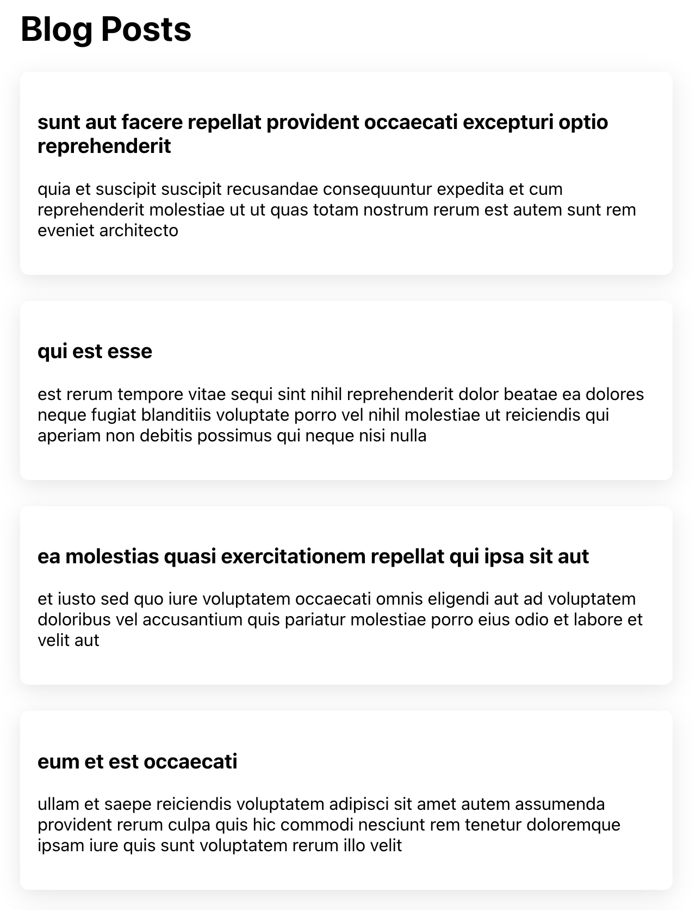
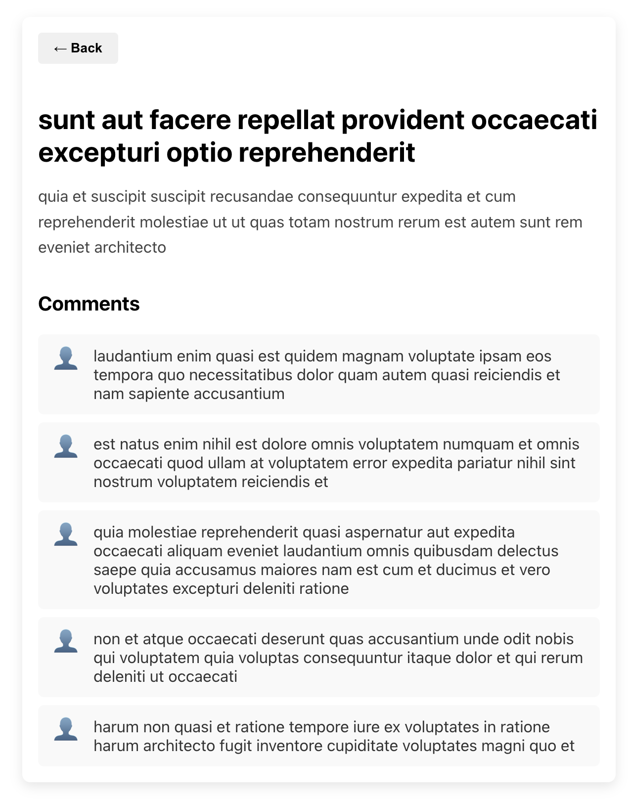

# Tech Forum

## Introduction
This React project serves as a playground for testing out designs and implementations (e.g. posts and comments) of my actual blog site ([Anthony's Blog Site](https://yuanlong-anthony-cui.netlify.app/)). For example, I first experimented here with the card layout for blog posts before applying it to my own blog site.

    
    

## Technical Highlights
- **Async data fetching**: For fetching data for the UI, instead of using GraphQL queries like on Anthony's Blog Site, this blog site uses `fetch()` in `useEffect()` - a more classic approach - to load in data on the initial render of a `BlogPost` component.
- **Mock API**: I came across _[JSONPlaceholder](https://jsonplaceholder.typicode.com/guide/)_ when trying to get mock data from a dummy API and found it easy to use. The API provides some common resources like `/users` and `/posts` as well as methods like `GET /posts/1` that developers could use off the shelf.
- **Testing**: For simple testing with Jest, individual tests were made with `test()` and test suites with `describe()`. Jest alone can handle logic tests (e.g. testing JS functions or Redux reducers), but when it comes to testing actual rendered React components (verifying DOM output, user interaction, etc.), we will need React Testing Library to handle the React part of the testing.